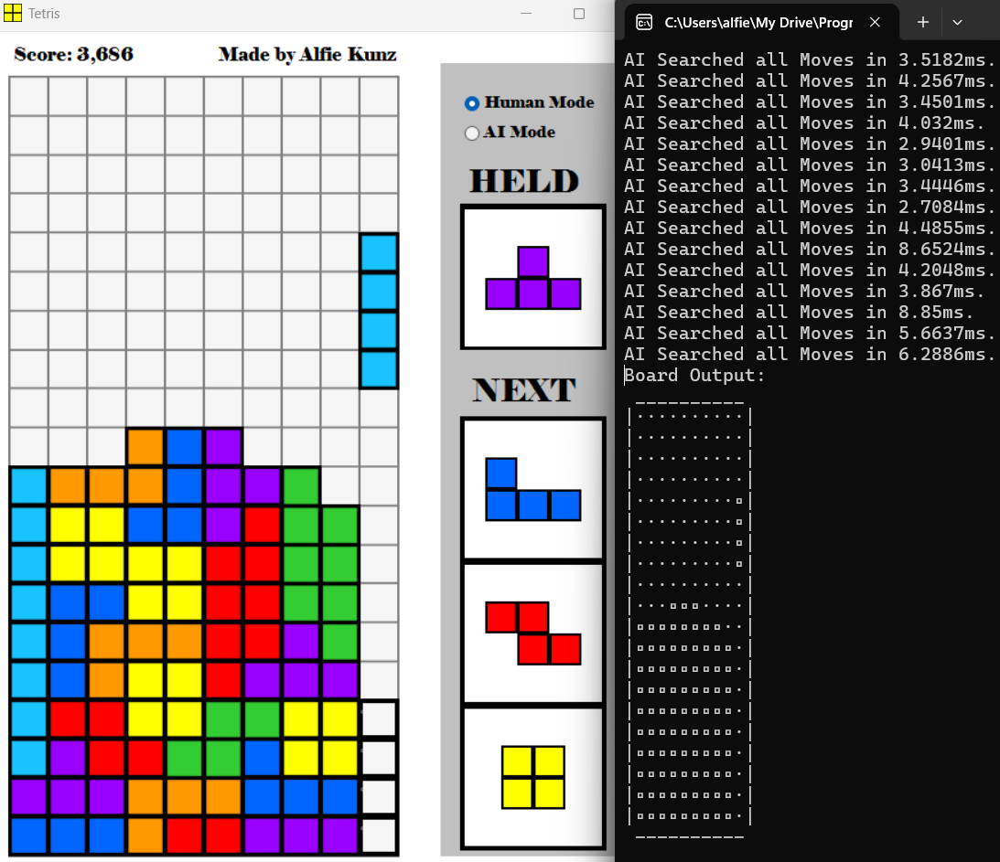

# Tetris Game & Artificial Intelligence


---

A program capable of hosting games of **Tetris** (using all official rules and scoring), for both the user via intuitive controls on a colourful GUI, and a **heuristic-based Artificial Intelligence** that works on a highly efficient representation of the same game board. This AI plays with no delay, is able to score efficiently for hours without losing, and is infinitely customisable for various playing styles.

This AI operates by performing a breadth-first tree traversal on all available unique keypress operations on a given piece (including moves that involve tricky T-spins!), then evaluating each resulting board position via a vast array of well-tuned heuristics to determine which path is the best in the current position! By optimising the search and board representation heavily, the AI is typically able to search the full set of moves in **under ~2ms**, providing ample opportunity for future work such as 2-ply or 3-ply searches, integration with other Tetris interfaces, and fine-tuning of evaluation heuristics via genetic algorithms.

This work is self-motivated and self-funded, and is written primarily in VB.NET as a Visual Studio WinForms application.

<p align="center">
  
</p>

---

## Features and Highlights

### Game Infrastructure & GUI
✅ Full padded Tetris board (replacing explicit edge-cases) supporting all 7 standard pieces: {I, J, L, O, S, Z, T}, held in a 7-bag randomised using a Fisher–Yates shuffle (guarantees every piece appears exactly once per cycle).  
✅ Complete game logic, including piece rotation, line clearing, precise classic NES Tetris (lv 1) scoring, and game-over logic.  
✅ Custom lightweight OOP-based 'Piece' class hierarchy (each piece pre-defined by 4 rotation states as variable-sized boolean grids): allows for O(1) piece rotation (by swapping piece indices rather than matrix reconstruction).  
✅ Per-column collision profiles (left/down/right edge info) precomputed once per piece, replacing cell-by-cell grid scans.  
✅ Per-row AI block counts precomputed for instant line-clear-compatibility checks.  
✅ Colourful WinForms GUI, hand-rendered from individually-positioned, guideline-coloured, and double-buffered (WS_EX_COMPOSITED) PictureBoxes.  
✅ Multithreading to allow the GUI to update whilst the AI is making moves (whilst allowing for user inputs mid-search).  
✅ Next-piece and held-piece GUI preview, showing the upcoming 3 pieces.  
✅ Ghost piece preview, showing exactly where the current piece will land if dropped.  
✅ Live ASCII mirror of the board printed to the console (redrawn live without scrolling) for debugging and syncing between the GUI and AI views.  
✅ Easy ability to reset games, and auto-resetting feature upon Game Over.  


### Artificial Intelligence & Heuristics
✅ Breadth-first search over all possible key-presses, allowing for a full discovery of all possible piece placements (including fancy T-spins, by taking advantage of interleaved move/rotate exploration) instead of traditional 'candidate column' approaches.  
✅ Biased BFS searches rotations before translations before drops, allowing for faster play by incentivising hard drops.  
✅ Reduced node searching by pruning positions already reached (by a shorter path via nature of BFS), immediately-reversing moves, and redundant triple-rotations.  
✅ Reconstruction of best path via parent-pointer backtracking (with trailing "Down" keys auto-collapsed into a hard drop).  
✅ AI pre-constructs and maintains its own lightweight board/height-map/hole-list snapshot, fully decoupled from the GUI's board objects. Allows for O(1) line-clear checking (maintains a precomputed empty-cell count against the piece's individual contribution), estimation of height and pre-existing holes, etc.  
✅ Piece moves during the search are made virtually and non-destructively, 'peeking' at new states without mutating actual piece state.  
✅ Comparison of the score achievable with the current piece against the held piece immediately upon piece spawn, allowing for rapid firing of key-presses at once, and swapping of held piece when the new score clears a tunable improvement threshold.  
✅ Per-column height map and aggregate stack height, updated incrementally for each simulated placement.  
✅ Bumpiness scoring penalises uneven column surfaces.  
✅ Dedicated edge 'well' column, kept clear for Tetris setups instead of being penalised as ordinary bumpiness.  
✅ Detection of extra pillars for discouraging over-reliance on line pieces.  
✅ New and pre-existing board hole detection with depth-scaled penalties (buried holes cost more, 'open' holes are penalised less than 'closed' holes, holes on the dedicated well are really bad).  
✅ Cubic reward scaling heavily favours multi-line and Tetris clears over single-line clears.  

---

## Project Showcase

> **Project Demo:** You can see this project live directly through the [**project build**](https://drive.google.com/drive/folders/1rwFGhKYf70273KD4Y7DlQtcX-P841d3L?usp=sharing) (Intel 32/64-bit). Simply click the 'Download All' button in the link attached, unzip and run the "Tetris.exe" application.

> **Program Controls:**  
Left / Right Arrow: Slide Piece Left / Right.  
Down Arrow: Move Piece Down.  
SPACE: Hard Drop Piece.  
Up Arrow: Rotate Piece Clockwise.  
A / D: Rotate Piece Anticlockwise / Clockwise.  
R: Reset Game.  
SHIFT: Hold Piece.
>1) The game of Tetris will start immediately upon program start-up, in the "Human" mode (ie: the user is making the moves), and will play until the game ends. To reset the game, simply restart the program.
>2) To let the AI make moves on the board, click the "AI Mode" button in the top right corner. The AI will always begin with holding the active piece, or hard-dropping it otherwise. Do not press any other keys when the AI is performing moves.
>3) To switch back to the "Human" mode at any time, simply press the other button in the top-right corner.

Alternatively, one can download the source code, as instructed below, for full control.

---

## Technical Details

This program stores the board and piece objects in a novel and highly-efficient way: the board is constructed as a list of padded 'BoardRow' objects, so that we can easily clear and move around lines. Pieces are OOP-based classes that hold boolean 2D arrays for each rotation state (so that rotating is as simple as indexing through the list of states), along with a set of {Left/Down/Right}EdgeInfo arrays that hold the distance each {Row/Column/Row} of each piece state is able to move before colliding with the board. This allows for O(1) translation of pieces and collision detection, rather than individual cell-by-cell grid scans. Note that rotations must still be checked on a cell-by-cell scan, but this is made much more efficient by only testing the active cells of the specific rotation state.

The AI operates by performing a BFS on all the available key-press combinations of the piece, creating a tree from the piece starting position where the set of leaf nodes is the unique placements of that piece on the board. To keep the tree tractable, we hash all visited nodes, and immediately reject redundant / reversing move combinations. By scoring each leaf node using a hand-crafted heuristic function (in the spirit of classic Tetris bots), and incentivising the shortest path in case of a score tie, we place pieces in the greedy optimal way. This score is compared to a separate search for the held piece (if it exists), and the best piece is selected. The AI class uses a separate set of board structures for each manipulation - we search on a static board and modify only a virtual piece position, so we can pre-compute many board properties and adjust them as needed when we consider a specific piece placement's evaluation. This allows for O(1) line clearing logic, and O(n) height and hole detection.

---

## Installation and Folder Structure

### Required Software: Visual Studio (.NET 6.0).

To install, simply clone this repository using the following terminal prompts.
```bash
git clone https://github.com/AlfieKunz/Tetris-AI
cd Tetris-AI
```
Then, simply open the "Tetris.sln" file in Visual Studio.

Feel free to also fork this repository, open an issue, or submit pull requests. All contributions welcome! :)  
To better navigate this project, please see below for the related folder structure.

```
Tetris-AI
├─ Build
│  ├─ Assets             // Contains all images used by the program: all piece colour blocks, all types of tetris pieces, game board picture
├─ Tetris                //
│  ├─ AI.vb              // Holds main AI code: translating core board information into instantly-retrievable base data, performing BFS, testing move making on board, board evaluation heuristics
│  ├─ Board.vb           // Holds board information as a list of Boolean BoardRows: sets & clears cells, checking full rows
│  ├─ Pieces.vb          // Efficient storing of a general piece type: creating edge information, handling transformations, getting and setting of relevant data for each rotation state
│  ├─ PieceTypes.vb      // Overrides for all piece types, containing info for all rotation states of each piece
│  ├─ Tetris.Designer.vb // WinForms design for the main program form: forms the main GUI, piece picturebox rendering and interactions with the user, scoring
│  └─ Tetris.vb          // Handles user interactions with the tetris board (inputting keypresses, creating and syncing the console board to the GUI board, generating & rendering & holding of pieces and the piece bag, movement and collision detection of pieces, handling of tetris rules and functionality), and instantiating and mapping AI moves to the main boards
└─ Tetris.sln            // Main VS code solution
```

---

## References & Inspiration

This work is self-motivated and self-funded. If you use this code or data in your work, please cite the associated preprint:

**Text Citation:**
> Kunz, A. (2024). *Tetris Game & Artificial Intelligence*. Available at https://github.com/AlfieKunz/Tetris-AI.

**BibTeX:**
```bibtex
@software{Kunz2024Tetris,
  title = {Tetris Game & Artificial Intelligence},
  author = {Kunz, Alfie},
  year = {2024},
  url = {https://github.com/AlfieKunz/Tetris-AI}
}
```

Project inspired from work by <a href="https://www.youtube.com/watch?v=QOJfyp0KMmM" target="_blank" rel="noopener noreferrer">Code Bullet</a>.